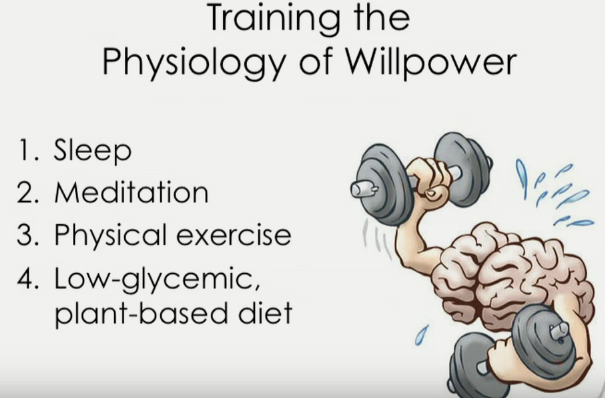
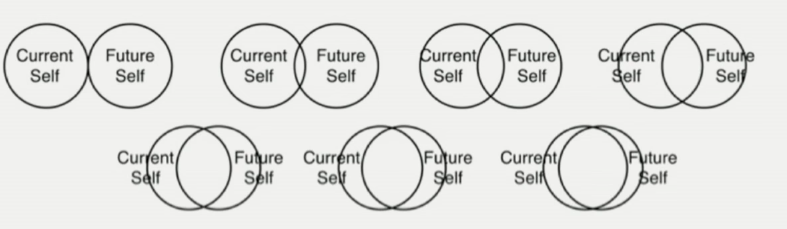
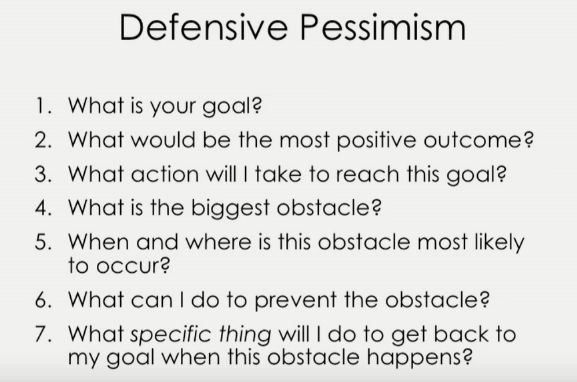
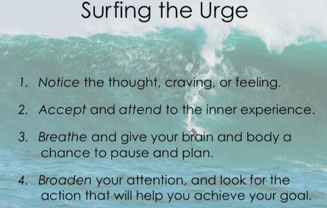
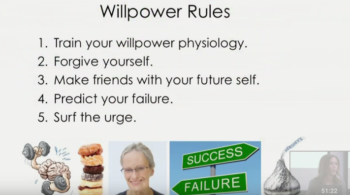

## Willpower Instinct ##
`by Kelly McGonigal`  

The brain has two personality. The competition between these two brains to out power and dictate the action can be described as willpower.
One knows that you should go to gym but another convinces to stay and watch the end of show. The willpower is choosing to do what you want to do. 

She gives small steps that we can take to increase our willpower. We easily fall in the trap of procrastination. Here, I add some notes of mine which as not discussed in the talk.

#### Willpower paradox ####
To follow these tips you would need at least some willpower. However, willpower needed to force or kick start these habits will generate more willpower in the system. 

### Some tips to improve your willpower ###

1. **Get more Sleep**  
    + Sleep more than 7 hours
        - 1.5 REM cycle 
        - more sleep more relaxed and more energy to tackle the task in hand.
    + Meditation -breathing
        - Just 5 minutes a day can increase the amount of [deep] sleep
    + Physical exercise
        - Working out in the gym (recommended)
        - Running or Cycling
    + Food
        - Eat food as it gives energy.
        - Continuous food intake(balanced diet) is important to well-being.
        - **fiber** is beneficial.  

1. **The Power of Forgiveness**  
    _Research Shows,_ The forgiveness of not doing will increase the chance of not repeating the same behavior. Feeling of remorse drain willpower. Gambler, drinker, procrastinator fall in vicious circle of remorse of 'not doing' then repeating 'not doing' in future, because they feel bad.
    **_Self compassion image_**
    + Be mindful of thoughts and feeling you feel after failing to complete task. Acknowledge the feeling.
    + Common humanity
        - often easy to feel _something fundamentally broken about you_.
        - But you should say, _this is part of the process and normal_.
        - What matters is _how you respond_ to the crisis.
    + Encouragement over Criticism
    What would you say to a friend, who is experiencing the same thing you are going thorough.
    The word of encouragement can be very positive in this scenario. It is helpful to remember the _big picture_.

1. **Get to know your future self **  
    `How different is your future self going to be in 30 years of time?`

    

    the more overlap ~= less likely to procrastinate, more likely to think of ethics.  
    + Letter to present self from the future.
        - Write about something future self benefited because present self did something. 

1. Imagine yourself being **Failure vs Success**  
    Predicting future failure, for immediate tasks, helps to complete a task.
    - we can predict failure and recognize the causes.
    - eventually run out of time of excuses.  
    - make pre-decision about what you are going to do, if something fails.

    > When people are complimented 'you are so close to your target', they are more likely to abandon the process. They are more likely to not follow the habits as they think they are close to their goal.

    - Being too optimistic with goals and to-do list is harmful.

    

1. **Tolerance Test**  
    Increasing once ability to tolerate and continue unpleasant task. By resisting more, you can increase more muscles. Similarly by having high tolerance will be beneficial to willpower.  
    - **Surf the urge**  
        The deep breath and delaying, harmful, task/process seems to favor the willpower. Convince yourself to wait for like 15second or more, before you commit certain task. This is called surfing the urge technique.
        
    > You don't need to do them. The urge, you don't have to give in. You can resist for a while.

#### Summary ####
The simple change in the habit or thinking process can have great impact in the willpower. Willpower is the limited commodity and it should be used wisely. The higher number rules require a little change in behavior and it can have more impact in willpower source.

This is good talk. she goes through interesting psychological studies done to back up the points made on the talk.

#### References ####
[Willpower Instinct by Kelly McGonigal at Talks at Google](https://www.youtube.com/watch?v=V5BXuZL1HAg)
